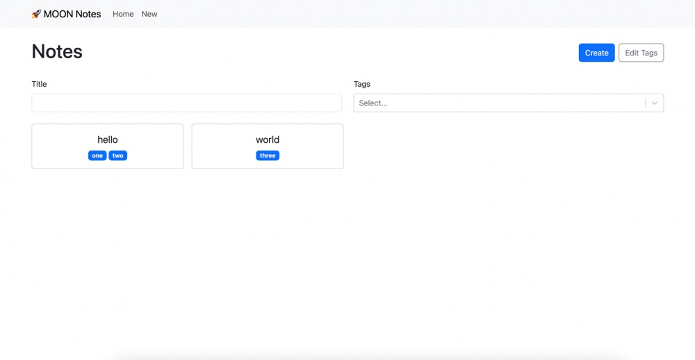

# Moon Notes

## Table of Contents

- [About](#about)
- [Example](#example)
- [Usage](#usage)
- [Roadmap](#usage)

## About

A simple React note taking application.

- React
- TypeScript
- Bootstrap
- React Router Dom
- React Markdown
- React Select
- Local Storage

## Example

## Usage

1. add here

## Roadmap

- [ ] Add Usage to README
